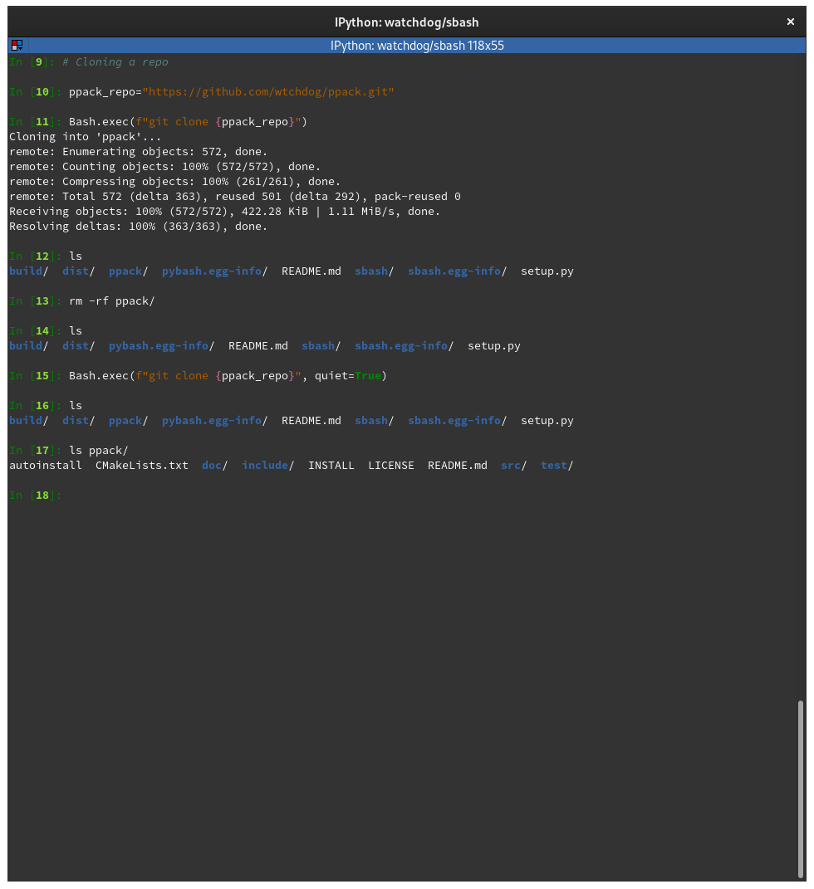

## Simple Python Interpreter for bash
This package enable you to run bash commands and scripts from Python.

#### Installation
```bash
    python3 -m pip install sbash
```

#### Usage
* Import Bash `class` from `sbash.core` as follow:
```bash
from sbash.core import Bash
```
`Bash` class have a static method `exec` that allow you to execute bash commands (in `string` or list of `strings` form).
```bash
Bash.exec(BASH_CMD, where=WHERE_RUN_BASH_CMD, quiet=TRUE_FOR_RUN_QUIETLY)
```

In the next examples I show you how to use the syntaxis above.



